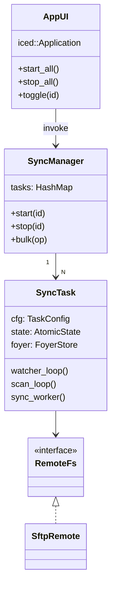

# FSync – 目录同步工具完整设计方案

> 版本：v1.0-draft  
> 更新时间：2025-08-04

---

## 目录

1. 目标 & 功能清单  
2. 技术选型  
3. 总体架构图  
4. 模块划分  
5. 关键数据结构  
6. 同步流程  
7. 异步模型  
8. Foyer 持久化策略  
9. 远程文件系统抽象 & SFTP 实现  
10. UI 设计（iced vs egui）  
11. 错误处理与重试  
12. 测试策略  
13. 里程碑

---

## 1. 目标 & 功能清单

1. 具有友好的桌面界面；
2. 监听本地文件/目录变动，实时同步到远程服务器；
3. 支持 **排除 / 包含** 规则配置；
4. Tokio + async 全异步实现；
5. 同时管理 **N** 条独立同步任务；
6. 每任务成功同步后，使用 **foyer crate**（磁盘混合模式）记录最后同步时间戳；
7. 每条任务可单独启停，亦支持全部/批量启停；
8. 应用启动时先 **根据缓存增量同步** 再进入监听模式；
9. 监听模式下定期（默认 300 ms）快速扫描，补偿可能遗漏的事件；
10. UI 框架优先选用 **iced**（保留 egui 分支以便对比）；
11. 远程文件操作抽象为 `RemoteFs` trait，**首个实现 SFTP**，后续可扩展 HTTP/gRPC 等。
12. 对于文件被修改的事件需要获取文件的修改时间和缓存对比以完全确定是修改了，因为event有时候会有问题
13. 除了支持 **排除 / 包含** 规则配置之外还应该增加按照大小过滤，可以设置大小范围，类似切片范围的方式描述(..|..n|n..|m..n)
14. 增加服务器连接失败重试次数配置，避免服务器无法连接的时候的无限重试，界面需要增加提示toast，item也需要特殊颜色标记
---

## 2. 技术选型

| 领域 | 方案 | 说明 |
|------|------|------|
| 异步运行时 | Tokio | 标准化 async 生态、成熟度高 |
| 文件监听 | `notify` crate | `recommended_watcher`，配合 `tokio::mpsc` |
| 本地缓存 | `foyer` (disk-hybrid) | 每任务独立目录 `cache/{task_id}` |
| 远程协议 | `RemoteFs` trait – 首期 SFTP | 阻塞库 `ssh2` 通过 `spawn_blocking` 包装 |
| UI 框架 | iced（Elm-style） | 消息驱动，天然异步；egui 作为候选 |

---

## 3. 总体架构图



---

## 4. 模块划分

| Crate / Module | 责任 |
|----------------|------|
| `fsync-core` | `SyncManager`, `SyncTask`, `FileOp`, `RemoteFs` trait & 工厂 |
| `fsync-remote-sftp` | `SftpRemote` 的具体实现 |
| `fsync-storage` | 封装 foyer，提供 `open_store()` |
| `fsync-ui-iced` | iced 桌面应用，实现交互 |
| `fsync-ui-egui` | (可选) egui 版本原型 |
| `fsync-cli` | 无界面批处理工具，便于测试 & 自动化 |
| `fsync-proto` | 远程通信 protobuf / JSON schema |

---

## 5. 关键数据结构

```rust
/// 可序列化到 TOML/JSON 的静态配置
#[derive(Serialize, Deserialize, Clone)]
struct TaskConfig {
    id:        Uuid,
    name:      String,
    local:     PathBuf,
    remote:    String,
    include:   Vec<Pattern>,
    exclude:   Vec<Pattern>,
    scan_ms:   u64,          // 默认 300
    remote_cfg: RemoteCfg,   // 远端参数（见下）
}

enum TaskState { Idle, Running, Error(String) }

struct SyncTaskHandle {
    cfg: TaskConfig,
    ctrl_tx: mpsc::Sender<TaskCommand>,
    state_rx: watch::Receiver<TaskState>,
}

enum TaskCommand { Start, Stop, Shutdown }
```

### 远端配置 & trait

```rust
/// TOML 片段
#[derive(Serialize, Deserialize, Clone)]
#[serde(tag = "type")]               // 打开枚举 as tagged-enum
enum RemoteCfg {
    sftp { host: String, user: String, password: Option<String>, key: Option<PathBuf> },
    // http { base_url: String, token: String },
    // ...
}
```

---

## 6. 同步流程

1. **启动** → 读取配置 → `SyncManager::start_all()`
2. **初始化**：
   * 打开 foyer；
   * **全量扫描** 本地树，将 `mtime > cache_ts` 的文件加入待同步队列；
3. **监听模式**：
   * `notify` watcher 推送事件；
   * 与扫描通道合并去重后给 `sync_worker`；
4. **sync_worker**：
   * 将待处理的 `FileOp` → `RemoteOp` 批量提交 `RemoteFs::apply_batch`；
   * 成功后写回 foyer 时间戳；
5. **周期扫描**：
   * `tokio::time::interval(scan_ms)`；
   * 递归 mtime 对比 foyer，补偿遗漏文件；
6. **启停**： UI 发送 `TaskCommand`，在 `select!` 中优雅退出子循环。

---

## 7. 异步模型示例

```rust
async fn run_task(cfg: TaskConfig, remote: Arc<dyn RemoteFs>) {
    let (op_tx, mut op_rx)   = mpsc::channel::<FileOp>(1024);
    let (ctrl_tx, mut c_rx)  = mpsc::channel::<TaskCommand>(4);

    // 子任务：文件系统监听
    tokio::spawn(fs_watch(cfg.local.clone(), op_tx.clone()));
    // 子任务：快捷扫描
    tokio::spawn(periodic_scan(cfg.clone(), op_tx.clone()));

    loop {
        tokio::select! {
            Some(op)  = op_rx.recv() => handle_op(op, &*remote).await?,
            Some(cmd) = c_rx.recv()  => if matches!(cmd, TaskCommand::Stop|TaskCommand::Shutdown) { break; }
        }
    }
}
```

---

## 8. Foyer 持久化策略

* 每任务独立目录：`cache/{task_uuid}`
* **Key** = 绝对路径（UTF-8）；**Value** = `u64`（秒或纳秒）
* 同步成功后 `put(key, mtime)`
* 启动 & 周期扫描时 `get(key)` 与本地 mtime 对比

```rust
let store = Foyer::open(task_cache_dir)?;
store.put(path, mtime).await?;
let last = store.get(path).await?.unwrap_or(0);
```

---

## 9. 远程文件系统抽象 & SFTP 实现

### 9.1 RemoteFs trait

```rust
use async_trait::async_trait;
use std::path::Path;
use anyhow::Result;

pub enum RemoteOp<'a> {
    Upload { local: &'a Path, remote: &'a str },
    Remove { remote: &'a str },
    MkDir  { remote: &'a str },
    Rename { from: &'a str, to: &'a str },
}

#[async_trait]
pub trait RemoteFs: Send + Sync + 'static {
    async fn apply_batch(&self, ops: Vec<RemoteOp<'_>>) -> Result<()>;
    async fn ping(&self) -> Result<()>;
}
```

### 9.2 SFTP 实现（`fsync-remote-sftp`）

```rust
pub struct SftpRemote { /* ssh2 Session & Sftp wrapped by Arc<Mutex<_>> */ }

impl SftpRemote {
    pub async fn connect(host: &str, user: &str, pw: Option<&str>, key: Option<&Path>) -> Result<Self> {
        // 1. spawn_blocking 创建 ssh2::Session & 认证
        // 2. 打开 SFTP 子通道
    }
}

#[async_trait]
impl RemoteFs for SftpRemote {
    async fn apply_batch(&self, ops: Vec<RemoteOp<'_>>) -> Result<()> {
        // 在 spawn_blocking 中串行执行 ssh2 调用；大文件可分片写入
    }

    async fn ping(&self) -> Result<()> {
        // 例如 sftp.stat(".")
    }
}
```

### 9.3 配置示例（TOML）

```toml
[[tasks]]
name    = "静态资源同步"
local   = "D:/web/static"
remote  = "/var/www/static"
include = ["**/*.js", "**/*.css"]
exclude = ["node_modules/**"]
scan_ms = 300

[tasks.remote]
type     = "sftp"
host     = "example.com:22"
user     = "deploy"
password = "********"  # 或
# key = "C:/Users/xxx/.ssh/id_rsa"
```

---

## 10. UI 设计要点

* **主界面**：任务列表（名称、状态、进度）、`Start / Stop / Edit / Delete` 按钮；顶部工具栏支持全部启停。  
* **配置对话框**：本地路径、远程路径、包含/排除 glob、扫描间隔、远程连接信息。  
* **消息流**：iced `Command::perform(async_fn, Msg::Done)` 连接 `SyncManager` 的 `watch` 通道；UI 实时刷新状态。

---

## 11. 错误处理与重试

1. 远程提交失败 → 指数退避（1 s → 2 s → … ≤ 60 s）；UI 警告。  
2. watcher 失效事件（如 IN_DELETE_SELF）→ 自动重建 watcher。  
3. 扫描/IO 错误 → 日志记录，不阻塞主循环。

---

## 12. 测试策略

| 层级 | 重点 | 方法 |
|------|------|------|
| 单元测试 | include/exclude 过滤、foyer 读写 | pure Rust tests |
| 集成测试 | 端到端同步、一致性 | 本地 SFTP mock 或 docker-sftp server |
| 压力测试 | 海量文件、批量 rename/delete | criterion + 随机文件生成 |

---

## 13. 里程碑

1. **v0.1** – 核心 `fsync-core` + CLI：全量同步 + 监听；  
2. **v0.2** – 集成 foyer + 周期扫描补偿；  
3. **v0.3** – iced UI，支持单任务启停；  
4. **v1.0** – 多任务、批量控制、SFTP 完整实现、配置持久化、错误重试。

---

> **备注**：本文档定位为整体设计蓝图，代码实现过程中如遇架构调整，请同步更新此文件。